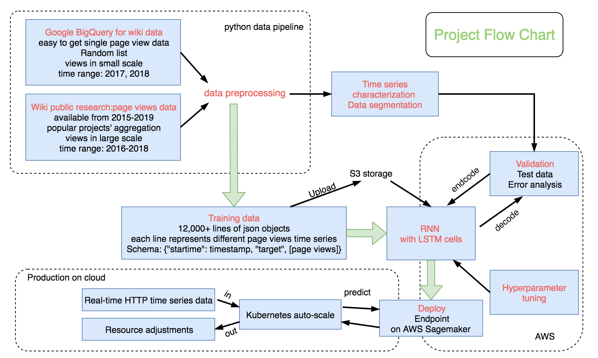

# Cloud Sage: Robust application load forecasting

This is a consulting project with Valence research at Manifold.co

## Problem
Nowadays cloud computing is on the rise. More and more businesses deploy their web apps on cloud platforms. When users access the web apps, this process generates web traffic. On the cloud platform, the orchestration system, for example, Kubernetes, will provision resources to handle different web traffic, this is done through auto-scaling. 

However, currently the auto-scaling is usually done reactively, this causes two problems: when the traffic is increasing, the control system couldn’t provision enough resource, this causes performance degradation, and leads to bad user experience. When the traffic is becoming light, the over-provision will cause wasted cost.

## Solution
To solve this problem, we need a better orchestration system with predictive auto-scaling. So we can predict the upcoming load, and adjust the provision beforehand-in this way, the performance is guaranteed, and cost is optimized.

To achieve predictive auto-scaling, we need to forecast the web application load traffic, which is essentially HTTP request time series. 

- **Model** Recurrent neural network with long short term memory

- **Data** Public available data, the wikipedia hourly pageview data on project level and per-article level.

- **Pipeline** I built the entire pipeline on AWS:
Data preprocessor --> training instance --> deploy trained model as Sagemaker endpoint --> Real-time query endpoint for inference

---
## Project flowchart and reports

1. Time series characterization and data segmentation method: [`characterize-and-segment-time-series.ipynb`](notebooks/visualization/characterize-and-segment-time-series.ipynb) demonstrates how to characterize different types of time series, then segment any given dataset and provide statistics.
2. Full evaluation of model prediction errors and robustness across different types of workloads: [`XXXX.ipynb`](notebooks/test/full_evaluation.ipynb)
3. Technical report states the following topics:
	- Model basics. 
	- Choice of error metric and interpretation 
	- Detailed explanation of the time series characterization method.
	- Model training details.
	- Steps taken to improve the model performance: hyperparameter tuning, feature extraction, increasing high quality training data.
	- A path forward for further improvements of the forecaster.

---
## Demo: inference from the deployed model endpoint
Please visit [my web app](http://www.cloudsage.xyz/ "www.cloudsage.xyz") to check prediction results of my deployed mode.

---
## What's included in this repo:

- Train and deploy the model yourself
	The pipeline is built on AWS sagemaker. Upload all the three module notebooks to sagemaker, start a notebook instance, and run the following code in order:

	`data_preprocessor.ipynb` This notebook will prepare the data channel in a S3 bucket to feed into the training instance. If you already have training/testing data, then skip this step and go head to train the model.

	`trainer.ipynb` will train the model, deploy the model as a Sagemaker endpoint for inference. The hyperparameters are obtained from a hyperparameter tuning job with smallest RMSE. Remember to delete the endpoint if the model is no longer in use.

	`predictor.ipynb` will take the test data as input, send http request to the specified model endpoint and get inference. Then followed with amazing analysis and beautiful plots (add them by yourself).

- `notebooks/` data analysis and model tests

	`notebooks/visualization` contains notebooks visualizing data exploratory analysis, time series characterization demostration, etc.

	`notebooks/test` contains intermediate training results with different training data and parameters.
- `src/` 

	`src/scripts` includes Python code of data preprocessors, error metrics, time series characterization function.

	`src/webapp` contains Python code for my demo web app, it is based Flask, deployed on AWS Elastic Beanstalk.
- `reports/`

	Technical documents and figures.

